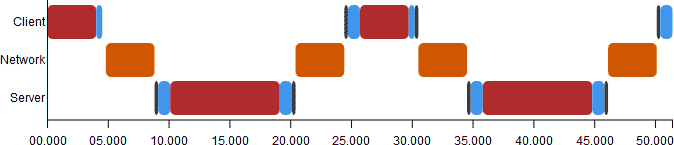

# Theory Exercise 3

Tarek Auel, Tiange Hu, Benedikt Christoph Naumann, Markus Schanz

## Task 1.1: Threading
Ein Monitor ist ein Konzept zur Synchronisierung zweier Prozesse/Threads, das einen gegenseitigen
Ausschluss erlaubt. Ein Monitor erlaubt, dass genau ein oder kein Thread sich zur gleichen Zeit
im kritischen Codebereich befindet. Befindet sich ein Thread im vom Montior geschützten Bereich,
müssen alle anderen, die ebenfalls einen durch diesen Monitor geschützen Bereich betreten wollen,
warten, bis der erste Prozess den kritischen Bereich verlassen hat. Ein Monitor besteht aus
Variablen und Prozeduren wobei die Variablen nur durch die Prozeduren geändert werden dürfen.
Die Prozeduren widerum sind durch den Monitor geschützt um die Synchronization ermöglichen und
ein Auftreten von raice-conditions zu verhindern.

## Task 1.2: Transparency in Java RMI
* :white_check_mark: Access transparency: is gegeben. Lokale und entferne Objekte, die in der
Registery angemeldet wurden, werden über diese auf die gleiche Art und Weise angesprochen.
* :white_check_mark: Location transparency ist gegeben. Objekte werden in der Registery mit einem
beliebigen Namen angemeldet. Dieser kann rein funktional sein.
* :negative_squared_cross_mark: Concurrency transparency ist nicht von Java RMI gegeben. Die
Ressourcen müssen dies selbst implementieren.
* :negative_squared_cross_mark: Replication transparency ist nicht gegeben. Jedem Namen (logisch
eine Resource) kann genau ein Objekt zugeordnet werden.
* :negative_squared_cross_mark: Failure transparency ist nicht gegeben. Die Registry ist
beispielsweise ein Single-Point-Of-Failure. Es sind auch keine anderen Methoden vorhanden, die
Ausfälle kompensieren können
* :negative_squared_cross_mark: Mobility transparency ist nicht gegeben. Zwar können Namen in der
Registry neu vergeben werden, allerdings bleiben bestehende Verbindungen davon unberührt.
* :negative_squared_cross_mark: Performance transparency ist nicht gegeben. Der Zugriff auf eine
lokale Ressource kann deutlich schneller sein. Außerdem sind keine Mechanismen implementiert, die 
eine Rekonfiguration zur Performancesteigerung erlauben.
* :negative_squared_cross_mark: Scaling transparency ist nicht gegeben. RMI erlaubt es nicht das
verteilte System auf einfache Weise durch weitere Knoten zu ergänzen. Durch die fehlende
Replication- und Mobility transparency würden neue Knoten nicht automatisch von der bestehenden
Infrastruktur genutzt werden können.

## Task 1.3: RMI - single-threaded vs multi-threaded
a)

In total: 45.2ms

b)

In total: 31.6ms

Edit charts @[JSFiddle](http://jsfiddle.net/pht5jsb1/2/)
