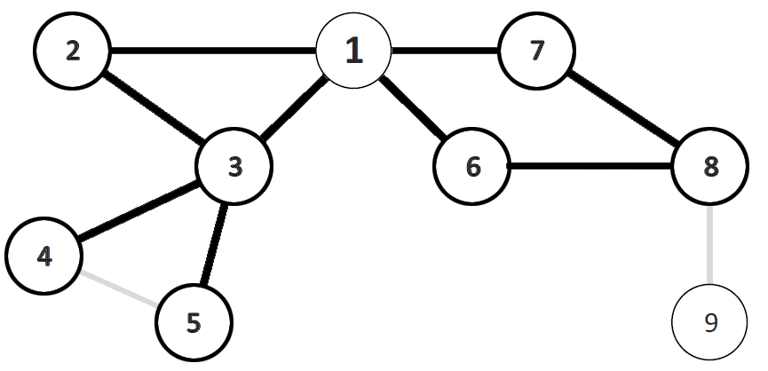

# Theory Exercise 7

Tarek Auel, Markus Schanz

## Task 1: Local View
In the graph below, the 2-hop neighborhood graph is formed only by the bold
nodes and edges, i.e. node 9 and the edge between node 4 and 5 and do not belong
to the 2-hop neighborhood graph (they were kept because the comparison to the
original graph is more easy this way).

## Task 2: LOCAL Model

## Task 3: Topology Control
