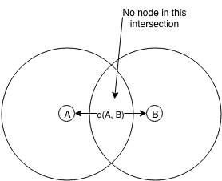

# Theory Exercise 7

Tarek Auel, Markus Schanz

## Task 1: Local View
In the graph below, the 2-hop neighborhood graph is formed only by the bold
nodes and edges, i.e. node 9 and the edge between node 4 and 5 and do not belong
to the 2-hop neighborhood graph (they were kept because the comparison to the
original graph is more easy this way).

## Task 2: LOCAL Model
First argument: **Inherently non-local Problem**  
A problem is called inherently non-local if the output of a node *v* depends on
the initial input of a node outside of Gk(v). (Every LOCAL algorithm
must depend only on the nodes in Gk(v), with k in {0,1,2,3,..}).  
The algorithm used to build a spanning tree in a network is such a problem, as a
node *v* is only capable of getting a partial view of the network (depending on
k). There is no constant upper bound k which solves this problem in general,
i.e. for arbitrary large networks.

Second argument: **Impossibility of Symmetry Breaking**  
As a general observation, the output of an algorithm in the LOCAL Model does
depend only on the input available within a constant-radius neighbourhood
(Gk(n)) of the node. This makes the LOCAL model deterministic and a
given distributed algorithm produces the same result on nodes that have an equal
view on the network, i.e. their neighborhood graph Gk looks alike.  
For example, this problem comes into play for symmetric network graphs
(e.g. n-cycle). A distributed algorithm which is used to self-assign an address
for each node in the network would assign each node the same address because
they all have the same view on the network.

## Task 3: Topology Control
Relative Neighborhood Graph (RNG) is a topology control algorithm. An edge from node
A to node B is only added if no node is in the intersection of the two
circles with radius of d(A,B) that starts from A and B.

This algorithm can never add an edge that crosses another edge, because there would
be always another node in the intersection. This property is important for the
Greedy Perimeter Stateless Routing because if a graph contains crossing edges it
can stay in an infinity loop while applying the right-hand rule.
