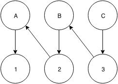
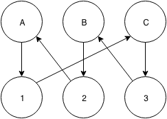

# Theory Exercise 8

Tarek Auel, Markus Schanz

## Task 1: Correctness in distributed Systems
**Safety Property** 
Safety properties describe predicates that are _always_ true in a distributed things. It can be
paraphrased as trying to make sure that bad things can never happen or that they are at least
identified within a finite number of steps.

A typical example is deadlock freedom. This property ensures that there is always at least one
process that can execute the next instruction. The following pictures shows three processes (1, 2, 3)
 and three resources (A, B, C). An arrow from a resource to a process does mean that is resource
 is assigned to the process. An arrow from a process to a resource does mean that the process requested
 the resource and it does wait for it. Even though 2 and 3 are blocked, A can execute, because it
 does not wait for a resource. The system is deadlock free and safety property is hold.
 
 
 
 The next pictures shows a circular wait situation. 1 waits for C, 2 for A and 3 for B. There is no
 process in the system that can do any progress. The deadlock property is violated.
 
 
 
**Liveness Property**
The liveness property ensures that a progress in the computation is always possible. It is important
to keep in mind that it says progress has to be possible. This is already hold if the target 
("desired") state is reachable, it doesn't do any statement about when this state will be reached.

## Task 2: Time synchronization using the algorithm by Christian
a) Which entry in the depicted table should C select to set its local clock?  
In order to get the best accuracy, C should choose the second entry, with a round-trip time of 18ms.

b) How accurate is the time estimate of C in relation to S?  
The time estimate of C (see next lines) has an accuracy of `±RTT/2 = ±18/2 = ±9ms`,

c) Which time should C set to its local clock?  
To the time it received from S, increased by half of the duration of the RTT: `newtime = 15:38:36.580 + 0.009 = 15:38:36.589`

d) The transmission of a message between C and S takes at least 4ms (for each direction). How does this change the answers for a-c?  
A minimum transmission delay of 4ms implies...:

- ... no change of the answer in a)
- ... a smaller error (=> higher accuracy): `accuracy = ±0.5 × (RTT - 2 × min_trans_delay) = ±0.5 × (18 - 8) = ±5ms`
- ... no change of the answer in c)

## Task 3: Time synchronization using NTP
**Note:** We assume that the timestamps given in the task, correspond to the local time of server A and B respectively.  
Using the formula on the slides, this translates into the following values:

- Ti-3 = 15.32.56.210
- Ti-2 = 15.32.56.400
- Ti-1 = 15.32.56.690
- Ti = 15.32.56.960

The estimated offset is given by **oi** = 0.5 × (Ti-2 - Ti-3 + Ti-1 - Ti) = 0.5 × (15.32.56.400 - 15.32.56.310 + 15.32.56.690 - 15.32.56.960) = 0.5 × (-180) = **-90ms**.  

In order to calculate the accuracy (according to the true clock offset `o`), we need to first calculate the transmission delay di:  
**di** = Ti-2 - Ti-3 + Ti - Ti-1 = 15.32.56.400 - 15.32.56.210 + 15.32.56.960 - 15.32.56.690 = **460ms**.  
The accuracy according to the real offset `o` is given by oi - di/2 ≤ o ≤ oi + di/2 ⇒ -90ms - 230ms ≤ o ≤ -90ms + 230ms ⇒ **-320ms ≤ o ≤ 140ms**
