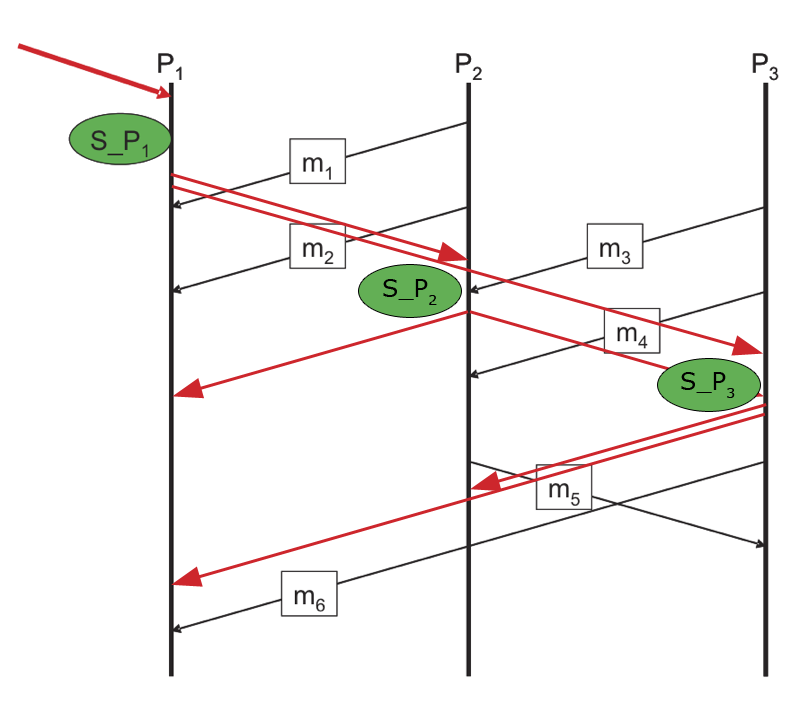

# Theory Exercise 9

Tarek Auel, Markus Schanz

## Task 1: ‘Snapshot’-Algorithm of Chandy and Lamport
### a)
Illustration 1.I is correct, as P1 forwards the marker message to P2 after recording its state and before sending any other message.

*Example for figure 1.I:*  
P1 receives the marker message and saves its local state immediately. It forwards the marker message to process P2, followed by a regular message. P2 receives the marker message first and creates a local snapshot. It then receives the regular message which is not part of the local snapshot, as it is received by P1 after the receiving the marker message. For both processes the message is not part of the snapshot, so the snapshot itself is consistent.

*Example for figure 1.II:*  
P1 receives the marker message and saves its local state immediately. It then sends a regular message to P2, followed by the marker message. The regular message is not part of the local snapshot, as it happens after the receiving of the marker message. Now P2 receives the regular message first, followed by the marker message. It creates a local snapshot, consisting of all previous events, including the receiving of the regular message from P1. After the algorithm finishes, the global snapshot that is created out of the local snapshots is inconsistent because there exists an receiving event for a message without a corresponding sending event.

### b)
*Variant 1:*  

**States**:  
<table>
    <tr>
        <td>S_P1: &lt;&gt;</td>
        <td>C(P2, P1): &lt;m1, m2&gt;</td>
        <td>C(P3, P1): &lt;&gt;</td>
    </tr>
    <tr>
        <td>S_P2: &lt;m1, m2&gt;</td>
        <td>C(P1, P2): &lt;&gt;</td>
        <td>C(P3, P2): &lt;m3, m4&gt;</td>
    </tr>
    <tr>
        <td>S_P3: &lt;m3, m4&gt;</td>
        <td>C(P1, P3): &lt;&gt;</td>
        <td>C(P2, P3): &lt;&gt;</td>
    </tr>
</table>

## Task 2: Snapshot vs. Actual Program Flow
### a)
### b)
